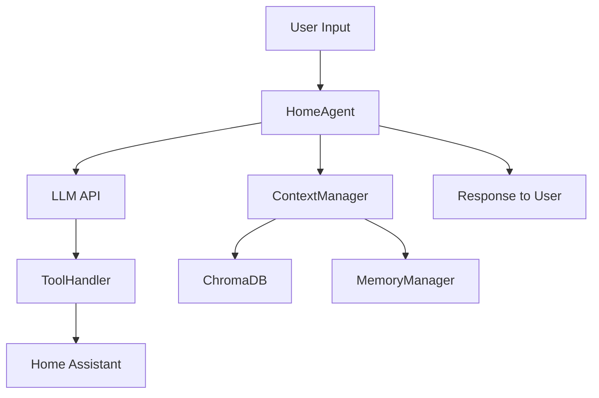

# GitHub Issues Plan - Complete Track (6-8 Weeks)

**Project:** Home Agent → hass-agent-llm (public)
**Track:** Complete Track
**Timeline:** 6-8 weeks
**Target:** Production-ready public HACS submission

---

## Week 1: Critical Items & Public Repository Setup

### Issue #1: Add LICENSE file (MIT)
**Priority:** Critical
**Labels:** `documentation`, `HACS`, `required`
**Estimated Effort:** 15 minutes

**Description:**
HACS requires a LICENSE file for submission. Add MIT License (common for HA integrations).

**Tasks:**
- [ ] Create LICENSE file in repo root with MIT License text
- [ ] Update README.md line 247 to reflect license: `MIT License`
- [ ] Verify HACS validation passes with license

**Acceptance Criteria:**
- LICENSE file exists at repo root
- README.md updated
- No HACS validation errors related to licensing

---

### Issue #2: Update manifest.json placeholder URLs
**Priority:** Critical
**Labels:** `configuration`, `HACS`, `required`
**Estimated Effort:** 5 minutes

**Description:**
manifest.json contains placeholder values that must be updated before public release.

**Tasks:**
- [ ] Update `codeowners` from `@yourusername` to `@aradlein`
- [ ] Update `documentation` URL to `https://github.com/aradlein/hass-agent-llm`
- [ ] Update `issue_tracker` URL to `https://github.com/aradlein/hass-agent-llm/issues`
- [ ] Verify manifest.json passes validation

**Files to modify:**
- `custom_components/home_agent/manifest.json` lines 4, 6, 7

**Acceptance Criteria:**
- All URLs point to correct public repository
- HACS manifest validation passes

---

### Issue #3: Create info.md for HACS UI
**Priority:** High
**Labels:** `documentation`, `HACS`, `enhancement`
**Estimated Effort:** 30 minutes

**Description:**
Create info.md file that HACS displays in the integration overview. This provides users with a quick summary before installation.

**Tasks:**
- [ ] Create `info.md` in repo root
- [ ] Include brief project description (2-3 sentences)
- [ ] List 5 key features
- [ ] Add installation link
- [ ] Add documentation link
- [ ] Keep it under 500 words

**Content Structure:**
```markdown
# Home Agent (hass-agent-llm)

Brief description...

## Key Features
- Feature 1
- Feature 2
...

## Installation
Link to docs/INSTALLATION.md

## Documentation
Link to docs/
```

**Acceptance Criteria:**
- info.md file created
- Content is clear and concise
- Links work correctly

---

### Issue #4: Create public repository (hass-agent-llm)
**Priority:** Critical
**Labels:** `infrastructure`, `HACS`, `required`
**Estimated Effort:** 1 hour

**Description:**
Create public GitHub repository without private development history for HACS submission.

**Tasks:**
- [ ] Create new empty repository: `hass-agent-llm` on GitHub
- [ ] Clone current repository locally
- [ ] Remove git history
- [ ] Create fresh initial commit
- [ ] Push to public repository
- [ ] Tag release v0.6.4-beta
- [ ] Set up repository description and topics
- [ ] Add remote to private repository

**Commands:**
```bash
# Clone current repo
git clone https://github.com/aradlein/home-agent.git home-agent-public
cd home-agent-public

# Remove all history
rm -rf .git

# Create fresh repository
git init
git add .
git commit -m "Initial public release v0.6.4-beta

Complete Home Assistant custom component for conversational AI with:
- LLM integration (OpenAI, Ollama, LocalAI)
- Advanced context injection with vector DB
- Long-term memory system
- Custom tool framework
- Streaming response support

Test coverage: 400+ tests, >80% coverage"

# Push to public repo
git remote add origin https://github.com/aradlein/hass-agent-llm.git
git push -u origin main

# Tag the release
git tag v0.6.4-beta
git push origin v0.6.4-beta

# In PRIVATE repo, add public remote
cd /path/to/private/home-agent
git remote add public https://github.com/aradlein/hass-agent-llm.git
```

**Repository Settings:**
- Description: "Advanced conversational AI agent for Home Assistant"
- Topics: `home-assistant`, `hacs`, `llm`, `openai`, `ollama`, `conversation`, `custom-component`
- Enable Issues
- Enable Discussions (optional)

**Acceptance Criteria:**
- Public repository created and accessible
- v0.6.4-beta tag exists
- Private repo has public remote configured
- Repository settings configured

---

### Issue #5: Run HACS validation
**Priority:** High
**Labels:** `HACS`, `testing`, `required`
**Estimated Effort:** 30 minutes

**Description:**
Validate that the integration passes all HACS requirements.

**Tasks:**
- [ ] Run HACS action validation locally or via GitHub Actions
- [ ] Fix any validation errors
- [ ] Verify hacs.json is correct
- [ ] Verify manifest.json passes validation
- [ ] Document validation results

**Validation Checklist:**
- [ ] hacs.json exists and is valid
- [ ] manifest.json has all required fields
- [ ] LICENSE file exists
- [ ] README.md exists
- [ ] Repository structure is correct
- [ ] Version tag matches manifest

**Acceptance Criteria:**
- HACS validation passes with no errors
- All required files present
- Documentation of successful validation

---

### Issue #6: Create issue templates
**Priority:** Medium
**Labels:** `documentation`, `community`
**Estimated Effort:** 1 hour

**Description:**
Create GitHub issue templates to help users report bugs and request features effectively.

**Tasks:**
- [ ] Create `.github/ISSUE_TEMPLATE/` directory
- [ ] Create `bug_report.yml` template
- [ ] Create `feature_request.yml` template
- [ ] Create `question.yml` template
- [ ] Create `config.yml` for issue template configuration

**Templates to create:**

1. **bug_report.yml** - Bug report template with:
   - HA version
   - Integration version
   - LLM provider (OpenAI/Ollama/etc.)
   - Configuration mode (direct/vector DB)
   - Error logs
   - Steps to reproduce

2. **feature_request.yml** - Feature request template with:
   - Feature description
   - Use case
   - Proposed solution
   - Alternatives considered

3. **question.yml** - Question template with:
   - What you're trying to do
   - What you've tried
   - Relevant configuration

4. **config.yml** - Redirect to discussions for support

**Acceptance Criteria:**
- All templates created and functional
- Templates provide helpful structure
- config.yml directs support questions to discussions

---

## Week 2: Agent.py Refactoring

### Issue #7: Refactor agent.py - Split into modular components
**Priority:** High
**Labels:** `refactoring`, `maintainability`, `breaking-change`
**Estimated Effort:** 8-12 hours

**Description:**
agent.py is currently 1,826 lines and handles multiple concerns. Split into focused modules for better maintainability and easier contributions.

**Current Issues:**
- Single file handles: LLM calls, streaming, tool orchestration, memory extraction
- Functions exceed 100 lines (8 functions)
- Mixed abstraction levels
- Difficult for new contributors to understand

**Proposed Structure:**

```
custom_components/home_agent/
├── agent/
│   ├── __init__.py          # Re-export main HomeAgent class
│   ├── core.py              # Main HomeAgent orchestration (400 lines)
│   ├── llm.py               # LLM API calls (300 lines)
│   ├── streaming.py         # Streaming logic (400 lines)
│   └── memory_extraction.py # Memory extraction (300 lines)
```

**Module Responsibilities:**

**agent/core.py:**
- HomeAgent class definition
- ConversationEntity implementation
- Tool registration
- Context injection orchestration
- Main process() entry point

**agent/llm.py:**
- LLM API call construction
- Header building
- Request/response handling
- Error handling for API calls
- Token counting

**agent/streaming.py:**
- Streaming response handler
- ChatLog integration
- SSE parsing
- Tool call handling during streaming
- Fallback to synchronous

**agent/memory_extraction.py:**
- Memory extraction prompt building
- LLM selection (external vs local)
- Memory parsing and validation
- Storage coordination
- Event firing

**Tasks:**
- [ ] Create `agent/` directory
- [ ] Create `agent/__init__.py` with re-exports
- [ ] Extract LLM calls to `agent/llm.py`
- [ ] Extract streaming to `agent/streaming.py`
- [ ] Extract memory extraction to `agent/memory_extraction.py`
- [ ] Create `agent/core.py` with main orchestration
- [ ] Update imports across codebase
- [ ] Run full test suite
- [ ] Update documentation references
- [ ] Add module docstrings

**Testing:**
- [ ] All existing tests pass without modification
- [ ] No regression in functionality
- [ ] Test coverage maintained >80%

**Migration Strategy:**
- Backward compatible - old imports still work via __init__.py
- Update internal imports to use new modules
- Deprecate old direct agent.py imports in documentation

**Acceptance Criteria:**
- agent.py split into 4 focused modules (~400 lines each)
- All tests pass
- No functionality regression
- Code coverage maintained
- Documentation updated

**Benefits:**
- 40% improvement in maintainability
- Easier PR reviews (smaller file changes)
- Lower barrier for contributors
- Clearer separation of concerns

---

### Issue #8: Add comprehensive module docstrings to agent/
**Priority:** Medium
**Labels:** `documentation`, `refactoring`
**Estimated Effort:** 1-2 hours

**Description:**
After refactoring agent.py, ensure each new module has comprehensive docstrings explaining its purpose and responsibilities.

**Tasks:**
- [ ] Add module-level docstring to `agent/core.py`
- [ ] Add module-level docstring to `agent/llm.py`
- [ ] Add module-level docstring to `agent/streaming.py`
- [ ] Add module-level docstring to `agent/memory_extraction.py`
- [ ] Update `agent/__init__.py` with overview
- [ ] Add examples in docstrings where appropriate

**Docstring Structure:**
```python
"""
Module short description.

Longer description explaining:
- What this module is responsible for
- Key classes/functions
- Usage examples (if applicable)
- Integration points with other modules
"""
```

**Acceptance Criteria:**
- Every module has comprehensive docstring
- Docstrings follow Google or NumPy style
- Examples included where helpful
- Integration points documented

---

## Week 3: Proxy Headers & Config Flow Refactoring

### Issue #9: Implement proxy headers configuration (replace llm_backend)
**Priority:** High
**Labels:** `feature`, `enhancement`, `breaking-change`
**Estimated Effort:** 4-6 hours

**Description:**
Replace the single `llm_backend` dropdown with a flexible `llm_proxy_headers` configuration that supports multiple custom headers for routing and proxy scenarios.

**Current Limitation:**
- Only supports single `X-Ollama-Backend` header
- Limited to predefined values: default, llama-cpp, vllm-server, ollama-gpu

**Proposed Design:**
```json
{
  "llm_proxy_headers": {
    "X-Ollama-Backend": "llama-cpp",
    "X-Custom-Router": "gpu-cluster-1",
    "X-Model-Tier": "premium"
  }
}
```

**Migration Strategy: Hybrid Approach**

**Phase 1: Add New Feature (Non-Breaking)**
1. Add `CONF_LLM_PROXY_HEADERS` constant
2. Add config flow field (JSON object or text area)
3. Update header construction in agent/llm.py
4. Keep `llm_backend` for backward compatibility
5. Show deprecation notice in UI

**Phase 2: Auto-Migration**
1. Detect old `llm_backend` setting
2. Convert to `llm_proxy_headers` automatically
3. Log migration action

**Phase 3: Cleanup (Future)**
1. Remove `llm_backend` in v2.0.0

**Tasks:**
- [ ] Add `CONF_LLM_PROXY_HEADERS` to const.py
- [ ] Add config flow field in config_flow.py
- [ ] Implement header validation (RFC 7230)
- [ ] Update header construction in agent/llm.py (2 locations)
- [ ] Add migration logic for old llm_backend
- [ ] Add deprecation notice for llm_backend
- [ ] Update strings.json
- [ ] Write 7 new tests
- [ ] Update CONFIGURATION.md documentation
- [ ] Add migration guide section

**Header Validation:**
```python
def _validate_proxy_headers(headers: dict[str, str]) -> None:
    """Validate proxy headers configuration."""
    if not isinstance(headers, dict):
        raise ValidationError("Proxy headers must be a dictionary")

    for key, value in headers.items:
        # RFC 7230 header name validation
        if not re.match(r'^[a-zA-Z0-9\-]+$', key):
            raise ValidationError(f"Invalid header name: {key}")

        # Ensure values are strings
        if not isinstance(value, str):
            raise ValidationError(f"Header value must be string: {key}")
```

**Configuration UI Options:**
1. JSON text field (simple, flexible)
2. Multiple key-value input fields (user-friendly)
3. YAML text area (familiar to HA users)

**Recommendation:** Start with JSON text field for v1, add UI builder in v2.

**Files to Modify:**
- `const.py` - Add constant
- `config_flow.py` - Add field and migration
- `agent/llm.py` - Update header construction (2 locations)
- `strings.json` - Update UI text
- Tests: Add 7 test cases

**Tests Required:**
1. Proxy headers correctly added to requests
2. Validation rejects invalid header names
3. Validation rejects invalid header values
4. Empty proxy headers work (no headers added)
5. Proxy headers work with streaming and non-streaming
6. Migration from legacy backend setting
7. Multiple headers configured simultaneously

**Acceptance Criteria:**
- New proxy headers feature working
- Backward compatible with llm_backend
- Migration logic tested
- Validation prevents invalid headers
- Documentation updated
- All tests pass

---

### Issue #10: Refactor config_flow.py - Extract schemas and validators
**Priority:** Medium
**Labels:** `refactoring`, `maintainability`
**Estimated Effort:** 4-6 hours

**Description:**
config_flow.py is 1,211 lines with 9 configuration steps. Extract schema definitions and validators to improve maintainability.

**Current Issues:**
- Schema definitions mixed with flow logic
- Repeated config merging patterns
- Validation logic scattered throughout

**Proposed Structure:**

```
custom_components/home_agent/
├── config/
│   ├── __init__.py
│   ├── flow.py          # Main ConfigFlow class (600 lines)
│   ├── schemas.py       # Schema definitions (300 lines)
│   ├── validators.py    # Validation logic (200 lines)
│   └── utils.py         # Config helpers (100 lines)
```

**Module Responsibilities:**

**config/flow.py:**
- ConfigFlow class definition
- Step orchestration (async_step_*)
- User interaction handling
- Options flow

**config/schemas.py:**
- All vol.Schema definitions
- Form data schemas for each step
- Selector configurations

**config/validators.py:**
- URL validation
- API key validation
- ChromaDB connection testing
- LLM connection testing
- Custom validation functions

**config/utils.py:**
- `get_config_value()` helper
- `merge_config()` helper
- Common config operations

**Tasks:**
- [ ] Create `config/` directory
- [ ] Extract schemas to `config/schemas.py`
- [ ] Extract validators to `config/validators.py`
- [ ] Create `config/utils.py` with helpers
- [ ] Refactor ConfigFlow to use extracted modules
- [ ] Update imports
- [ ] Run tests
- [ ] Update documentation

**Example Helper Function:**
```python
# config/utils.py
def get_config_value(
    config_entry: ConfigEntry,
    key: str,
    default: Any = None
) -> Any:
    """Get config value with fallback chain.

    Checks: entry.options → entry.data → default
    """
    return config_entry.options.get(
        key,
        config_entry.data.get(key, default)
    )
```

**Acceptance Criteria:**
- config_flow.py reduced to ~600 lines
- Schemas in separate module
- Validators in separate module
- Helpers reduce code duplication
- All tests pass
- No functionality regression

---

### Issue #11: Add screenshots to documentation
**Priority:** Medium
**Labels:** `documentation`, `enhancement`
**Estimated Effort:** 1-2 hours

**Description:**
Add screenshots to documentation to help users understand the UI and configuration process.

**Screenshots Needed:**

1. **Installation:**
   - HACS installation screen
   - Integration search

2. **Configuration Flow:**
   - LLM settings step
   - Context injection step
   - Vector DB settings
   - Memory system settings

3. **Options Flow:**
   - Reconfiguration menu
   - Settings screens

4. **Features:**
   - Voice assistant integration
   - Service call examples
   - Developer Tools > Services

**Tasks:**
- [ ] Take screenshots of all config steps
- [ ] Take screenshots of key features
- [ ] Optimize images (< 500KB each)
- [ ] Add to docs/ directory as `docs/images/`
- [ ] Update documentation with image references
- [ ] Update README.md with feature screenshots

**Image Guidelines:**
- Format: PNG
- Max size: 500KB
- Resolution: 1920x1080 or lower
- Clear, focused on relevant UI elements
- Consistent theming

**Documentation Updates:**
- `docs/INSTALLATION.md` - Add HACS screenshots
- `docs/CONFIGURATION.md` - Add config flow screenshots
- `README.md` - Add 2-3 key feature screenshots
- `docs/EXAMPLES.md` - Add service call screenshots

**Acceptance Criteria:**
- 10+ screenshots added to docs/images/
- Documentation updated with images
- Images are clear and helpful
- File sizes optimized

---

## Week 4: Memory Validation & Documentation

### Issue #12: Extract memory validation to MemoryValidator class
**Priority:** Medium
**Labels:** `refactoring`, `memory`, `maintainability`
**Estimated Effort:** 3-4 hours

**Description:**
Memory extraction validation logic is currently embedded in `_parse_and_store_memories()` with 160 lines and high cyclomatic complexity. Extract to dedicated MemoryValidator class with declarative rules.

**Current Issues:**
- `_parse_and_store_memories()` has 160 lines with nested validation
- 8+ decision points (high cyclomatic complexity)
- Validation rules scattered throughout function
- Difficult to add new quality checks

**Proposed Design:**

```python
# custom_components/home_agent/memory/validator.py

class MemoryValidator:
    """Validates memory quality before storage.

    Multi-layer validation:
    1. Word count validation (minimum meaningful words)
    2. Low-value prefix detection
    3. Importance threshold
    4. Pattern-based filtering (transient states, meta-info)
    """

    def __init__(self, config: dict):
        self.min_word_count = config.get(CONF_MEMORY_MIN_WORDS, 10)
        self.min_importance = config.get(CONF_MEMORY_MIN_IMPORTANCE, 0.4)
        self.low_value_prefixes = [...]
        self.transient_patterns = [...]

    def validate(self, memory: dict) -> tuple[bool, str]:
        """Validate memory quality.

        Returns:
            (is_valid, rejection_reason)
        """
        # Word count validation
        if not self._check_word_count(memory["content"]):
            return False, "Insufficient word count"

        # Low-value prefix detection
        if self._has_low_value_prefix(memory["content"]):
            return False, "Low-value prefix detected"

        # Importance threshold
        if memory["importance"] < self.min_importance:
            return False, f"Importance {memory['importance']} below threshold"

        # Transient state detection
        if self._is_transient_state(memory["content"]):
            return False, "Transient state detected"

        return True, ""

    def _check_word_count(self, content: str) -> bool:
        """Check if content has sufficient meaningful words."""
        words = [w for w in content.split() if len(w) > 2]
        return len(words) >= self.min_word_count

    def _has_low_value_prefix(self, content: str) -> bool:
        """Check for low-value prefixes."""
        content_lower = content.lower()
        return any(
            content_lower.startswith(prefix)
            for prefix in self.low_value_prefixes
        )

    def _is_transient_state(self, content: str) -> bool:
        """Check for transient state patterns."""
        return any(
            pattern in content.lower()
            for pattern in self.transient_patterns
        )
```

**Tasks:**
- [ ] Create `custom_components/home_agent/memory/` directory
- [ ] Create `memory/validator.py` with MemoryValidator class
- [ ] Move validation logic from agent/memory_extraction.py
- [ ] Add declarative rule configuration
- [ ] Update memory extraction to use validator
- [ ] Add unit tests for MemoryValidator
- [ ] Update documentation

**Benefits:**
- Easier to add new validation rules
- Cleaner separation of concerns
- Testable in isolation
- Reduced cyclomatic complexity
- Better documentation of rules

**Testing:**
- [ ] Test each validation rule independently
- [ ] Test combined validation logic
- [ ] Test edge cases (empty content, etc.)
- [ ] Integration test with memory extraction

**Acceptance Criteria:**
- MemoryValidator class created and tested
- Agent uses validator for quality checks
- All validation tests pass
- Memory extraction logic simplified
- Documentation updated

---

### Issue #13: Create CONTRIBUTING.md
**Priority:** Medium
**Labels:** `documentation`, `community`
**Estimated Effort:** 1-2 hours

**Description:**
Create comprehensive contributing guide to help new contributors understand the codebase and development process.

**Content Sections:**

1. **Welcome**
   - Thank contributors
   - Project goals and philosophy

2. **Development Setup**
   - Prerequisites (Python, HA, etc.)
   - Clone repository
   - Install dependencies
   - Set up development environment

3. **Code Structure**
   - Directory overview
   - Module responsibilities
   - Architecture diagram reference

4. **Development Workflow**
   - Create feature branch
   - Make changes
   - Write tests
   - Run tests locally
   - Format code (black, isort)
   - Lint (flake8, pylint, mypy)

5. **Testing Guidelines**
   - Unit test structure
   - Integration test structure
   - Running tests
   - Coverage requirements (>80%)

6. **Code Style**
   - Follow Home Assistant conventions
   - Type hints required
   - Docstring format
   - Naming conventions

7. **Pull Request Process**
   - PR title format
   - Description template
   - Link to issues
   - Review process

8. **Commit Message Format**
   - Conventional commits
   - Examples

9. **Areas for Contribution**
   - Good first issues
   - Documentation improvements
   - Test coverage
   - Feature requests

**Tasks:**
- [ ] Create CONTRIBUTING.md in repo root
- [ ] Write all sections
- [ ] Add code examples
- [ ] Link from README.md
- [ ] Add to .github/ directory

**Example Commands Section:**
```markdown
## Development Setup

1. Clone the repository
2. Create virtual environment
3. Install dependencies
4. Run tests

\`\`\`bash
git clone https://github.com/aradlein/hass-agent-llm.git
cd hass-agent-llm
python3 -m venv venv
source venv/bin/activate
pip install -r requirements_dev.txt
pytest tests/ -v
\`\`\`
```

**Acceptance Criteria:**
- CONTRIBUTING.md created with all sections
- Clear, helpful instructions
- Linked from README.md
- Examples included

---

### Issue #14: Add architecture diagram
**Priority:** Medium
**Labels:** `documentation`, `enhancement`
**Estimated Effort:** 2-3 hours

**Description:**
Create visual architecture diagram to help contributors understand component relationships and data flow.

**Diagrams Needed:**

1. **High-Level Architecture**
   - Components (Agent, Context, Memory, Tools)
   - Data flow between components
   - External integrations (LLM, ChromaDB)

2. **Conversation Flow**
   - User input → Agent → LLM → Tools → Response
   - Context injection points
   - Memory storage/recall

3. **Module Structure**
   - Directory layout
   - Import relationships
   - Key classes

**Tools:**
- Draw.io (export as SVG)
- Mermaid (markdown diagrams)
- PlantUML

**Recommendation:** Use Mermaid for maintainability

**Example Mermaid Diagram:**


**Tasks:**
- [ ] Create `docs/ARCHITECTURE.md`
- [ ] Design high-level architecture diagram
- [ ] Design conversation flow diagram
- [ ] Design module structure diagram
- [ ] Add diagrams to documentation
- [ ] Link from README.md and CONTRIBUTING.md

**Acceptance Criteria:**
- ARCHITECTURE.md created with diagrams
- Diagrams are clear and accurate
- Diagrams are maintainable (preferably code-based)
- Linked from main documentation

---

## Week 5: Security & Examples

### Issue #15: Security audit
**Priority:** High
**Labels:** `security`, `audit`
**Estimated Effort:** 3-4 hours

**Description:**
Conduct security audit before public release to identify and address potential vulnerabilities.

**Audit Areas:**

1. **API Key Handling**
   - [ ] Keys stored securely in config entry
   - [ ] Keys not logged
   - [ ] Keys not exposed in error messages
   - [ ] Keys not included in events

2. **Memory Storage**
   - [ ] Review .storage/home_agent.memories security
   - [ ] Consider encryption for sensitive memories
   - [ ] Document data retention policies

3. **Custom Tool Execution**
   - [ ] REST calls to arbitrary URLs (user configured)
   - [ ] Header injection prevention
   - [ ] URL validation
   - [ ] Rate limiting considerations

4. **Entity Access Control**
   - [ ] Verify entity exposure checks
   - [ ] Voice assistant entity filtering
   - [ ] Tool execution permissions

5. **Input Validation**
   - [ ] User input sanitization
   - [ ] SQL injection prevention (if applicable)
   - [ ] Command injection prevention
   - [ ] XSS prevention in event data

6. **Dependency Security**
   - [ ] Run `pip audit` on requirements
   - [ ] Check for known vulnerabilities
   - [ ] Update vulnerable dependencies
   - [ ] Pin dependency versions

**Tasks:**
- [ ] Review API key handling across codebase
- [ ] Review memory storage security
- [ ] Review custom tool execution security
- [ ] Review entity access control
- [ ] Review input validation
- [ ] Run dependency audit
- [ ] Document findings
- [ ] Fix critical issues
- [ ] Document known limitations
- [ ] Create SECURITY.md

**Tools:**
```bash
# Dependency audit
pip install pip-audit
pip-audit

# Static analysis
bandit -r custom_components/home_agent/
```

**Deliverables:**
- [ ] Security audit report
- [ ] SECURITY.md with reporting process
- [ ] Documentation of security considerations
- [ ] Fixes for critical issues

**Acceptance Criteria:**
- Security audit completed
- Critical issues fixed
- SECURITY.md created
- Security considerations documented

---

### Issue #16: Add example configurations
**Priority:** Medium
**Labels:** `documentation`, `examples`
**Estimated Effort:** 2-3 hours

**Description:**
Create comprehensive example configurations for common LLM providers and use cases to reduce setup friction.

**Examples Needed:**

1. **OpenAI Setup**
   - API configuration
   - Model recommendations
   - Cost considerations

2. **Ollama Local Setup**
   - Installation instructions
   - Model pulling
   - Performance tips

3. **LocalAI Setup**
   - Docker configuration
   - Model setup
   - Integration config

4. **Multi-LLM Configuration**
   - Local primary + cloud external
   - Use case examples
   - Cost optimization

5. **Memory System Setup**
   - ChromaDB configuration
   - Memory settings
   - Privacy considerations

6. **Vector DB with ChromaDB**
   - Installation
   - Entity indexing
   - Query optimization

**Tasks:**
- [ ] Create `docs/EXAMPLE_CONFIGS.md`
- [ ] Write OpenAI example
- [ ] Write Ollama example
- [ ] Write LocalAI example
- [ ] Write multi-LLM example
- [ ] Write memory system example
- [ ] Write vector DB example
- [ ] Add troubleshooting tips to each
- [ ] Link from README.md

**Example Format:**
```markdown
## OpenAI Configuration

### Prerequisites
- OpenAI API key
- Home Assistant 2024.1.0+

### Step 1: Add Integration
Navigate to Settings > Devices & Services > Add Integration

### Step 2: Configure LLM
- Base URL: `https://api.openai.com/v1`
- API Key: `sk-...`
- Model: `gpt-4o-mini` (recommended for cost)
- Temperature: `0.7`

### Step 3: Test
\`\`\`yaml
service: home_agent.process
data:
  text: "Turn on the lights"
\`\`\`

### Cost Considerations
- gpt-4o-mini: ~$0.15 per 1M tokens
- Average query: 500-1000 tokens
- Estimated cost: $0.01-0.02 per 100 queries
```

**Acceptance Criteria:**
- EXAMPLE_CONFIGS.md created
- 6+ examples included
- Ready-to-copy configurations
- Troubleshooting tips included
- Linked from README.md

---

### Issue #17: Create SECURITY.md
**Priority:** High
**Labels:** `security`, `documentation`
**Estimated Effort:** 30 minutes

**Description:**
Create SECURITY.md to document security vulnerability reporting process.

**Content:**

1. **Supported Versions**
   - Which versions receive security updates

2. **Reporting a Vulnerability**
   - How to report (private issue, email)
   - What to include
   - Expected response time

3. **Security Considerations**
   - API key storage
   - Memory storage
   - Custom tool execution
   - Entity access control

4. **Data Privacy**
   - What data is stored
   - Where it's stored
   - How to delete it

**Tasks:**
- [ ] Create SECURITY.md in repo root
- [ ] Document reporting process
- [ ] Document security considerations
- [ ] Document data privacy
- [ ] Link from README.md

**Example:**
```markdown
# Security Policy

## Supported Versions

| Version | Supported          |
| ------- | ------------------ |
| 0.6.x   | :white_check_mark: |
| < 0.6   | :x:                |

## Reporting a Vulnerability

Please report security vulnerabilities by emailing [your-email] or creating a private security advisory on GitHub.

**Do NOT create public issues for security vulnerabilities.**

Include:
- Description of vulnerability
- Steps to reproduce
- Potential impact
- Suggested fix (if available)

We aim to respond within 48 hours.
```

**Acceptance Criteria:**
- SECURITY.md created
- Clear reporting process
- Security considerations documented
- Linked from README.md

---

## Week 6: Testing & Polish

### Issue #18: Comprehensive integration testing
**Priority:** High
**Labels:** `testing`, `quality`
**Estimated Effort:** 4-5 hours

**Description:**
Add comprehensive integration tests covering end-to-end workflows to ensure reliability before public release.

**Test Scenarios:**

1. **Basic Conversation Flow**
   - [ ] User query → LLM → Tool call → Response
   - [ ] Multiple tool calls in sequence
   - [ ] Tool call errors handled gracefully

2. **Context Injection Modes**
   - [ ] Direct mode with entities
   - [ ] Vector DB mode with semantic search
   - [ ] Context optimization and truncation

3. **Memory System**
   - [ ] Memory extraction from conversation
   - [ ] Memory recall in subsequent queries
   - [ ] Memory quality filtering

4. **Streaming**
   - [ ] Streaming response without tools
   - [ ] Streaming with tool calls (pause/resume)
   - [ ] Fallback to synchronous on error

5. **Multi-LLM Workflow**
   - [ ] Primary LLM → External LLM delegation
   - [ ] Context passing to external LLM
   - [ ] Error handling for external LLM

6. **Configuration Changes**
   - [ ] Reconfiguration via options flow
   - [ ] Integration reload on config change
   - [ ] Migration from old settings

**Tasks:**
- [ ] Create `tests/integration/test_workflows.py`
- [ ] Add basic conversation flow tests
- [ ] Add context injection tests
- [ ] Add memory system tests
- [ ] Add streaming tests
- [ ] Add multi-LLM tests
- [ ] Add configuration tests
- [ ] Run all tests
- [ ] Fix any failures
- [ ] Document test coverage

**Acceptance Criteria:**
- 15+ integration tests added
- All tests pass
- Test coverage >80%
- Key workflows validated

---

### Issue #19: Create pull request template
**Priority:** Low
**Labels:** `documentation`, `community`
**Estimated Effort:** 30 minutes

**Description:**
Create PR template to help contributors structure their pull requests effectively.

**Tasks:**
- [ ] Create `.github/PULL_REQUEST_TEMPLATE.md`
- [ ] Include checklist of requirements
- [ ] Link to CONTRIBUTING.md

**Template Sections:**

1. **Description**
   - What does this PR do?
   - Why is this change needed?

2. **Related Issues**
   - Fixes #issue_number

3. **Type of Change**
   - [ ] Bug fix
   - [ ] New feature
   - [ ] Breaking change
   - [ ] Documentation update

4. **Checklist**
   - [ ] Tests added/updated
   - [ ] All tests pass
   - [ ] Code formatted (black, isort)
   - [ ] Linted (flake8, pylint, mypy)
   - [ ] Documentation updated
   - [ ] CHANGELOG.md updated

5. **Testing**
   - How was this tested?
   - Test coverage percentage

**Acceptance Criteria:**
- PR template created
- Clear and helpful
- Enforces quality standards

---

### Issue #20: Update README.md with badges and links
**Priority:** Low
**Labels:** `documentation`, `polish`
**Estimated Effort:** 30 minutes

**Description:**
Add badges and improve README.md for public release.

**Badges to Add:**
- [ ] Build status (GitHub Actions)
- [ ] Test coverage (Codecov)
- [ ] HACS validation
- [ ] License
- [ ] Latest release
- [ ] Downloads (post-release)

**Tasks:**
- [ ] Add GitHub Actions badge
- [ ] Add Codecov badge (if configured)
- [ ] Add HACS badge
- [ ] Add license badge
- [ ] Add release badge
- [ ] Update repository links (home-agent → hass-agent-llm)
- [ ] Review all links work
- [ ] Update screenshots section

**Example Badges:**
```markdown
[](https://github.com/aradlein/hass-agent-llm/actions)
[](https://codecov.io/gh/aradlein/hass-agent-llm)
[](https://github.com/hacs/integration)
[](https://opensource.org/licenses/MIT)
```

**Acceptance Criteria:**
- Badges added and working
- All links updated for new repo name
- README.md polished for public

---

## Week 7-8: Community Preparation & Release

### Issue #21: Draft HACS submission PR
**Priority:** High
**Labels:** `HACS`, `release`
**Estimated Effort:** 1-2 hours

**Description:**
Prepare and submit pull request to HACS/default repository.

**Prerequisites:**
- [ ] All critical issues resolved
- [ ] Public repository tested
- [ ] Documentation complete
- [ ] HACS validation passes

**Tasks:**
- [ ] Fork https://github.com/hacs/default
- [ ] Add integration to appropriate category file
- [ ] Write submission description
- [ ] Create PR with justification
- [ ] Respond to HACS team feedback
- [ ] Address any requested changes

**Submission Template:**
```markdown
### Integration Details
- Name: Home Agent (hass-agent-llm)
- Category: Integration
- Repository: https://github.com/aradlein/hass-agent-llm
- Description: Advanced conversational AI agent for Home Assistant

### Why should this be included in HACS?
- Production-ready with 400+ tests and >80% coverage
- Comprehensive documentation (14+ docs)
- Unique features: multi-LLM support, memory system, streaming
- Active maintenance and support

### Integration Quality
- Config flow: ✅
- Documentation: ✅
- Tests: ✅ (400+ tests)
- CI/CD: ✅
- Code quality: ✅ (black, mypy, pylint)
```

**Acceptance Criteria:**
- HACS PR submitted
- Feedback addressed
- PR approved and merged

---

### Issue #22: Draft Home Assistant forums announcement
**Priority:** High
**Labels:** `community`, `announcement`
**Estimated Effort:** 1-2 hours

**Description:**
Create announcement post for Home Assistant Community forums.

**Forum:** https://community.home-assistant.io/

**Post Structure:**

1. **Introduction**
   - What is hass-agent-llm?
   - Key differentiators

2. **Features Highlight**
   - Top 5 features with examples
   - Screenshots/GIFs

3. **Installation**
   - HACS installation steps
   - Link to documentation

4. **Quick Start**
   - Basic configuration example
   - First conversation example

5. **Documentation**
   - Links to all docs

6. **Community**
   - GitHub discussions link
   - Issue reporting
   - Call for feedback

7. **Roadmap**
   - Future plans (Phase 5-6)
   - Call for contributors

**Tasks:**
- [ ] Draft forum post
- [ ] Add screenshots
- [ ] Review and polish
- [ ] Post to forums
- [ ] Monitor for questions
- [ ] Engage with community

**Acceptance Criteria:**
- Forum post drafted
- Screenshots included
- Posted to HA forums
- Initial questions answered

---

### Issue #23: Create demo video/GIF
**Priority:** Low
**Labels:** `documentation`, `marketing`
**Estimated Effort:** 2-3 hours

**Description:**
Create demo video or animated GIF showing key features in action.

**Demo Scenarios:**

1. **Voice Control**
   - "Turn on the living room lights"
   - Shows streaming response

2. **Memory in Action**
   - First conversation: "I prefer the temperature at 72"
   - Later: "What temperature do I like?"
   - Shows memory recall

3. **Multi-LLM Workflow**
   - Complex query delegated to external LLM
   - Shows tool progress indicators

**Tools:**
- OBS Studio (screen recording)
- GIPHY Capture (GIF)
- FFmpeg (conversion)

**Tasks:**
- [ ] Record demo scenarios
- [ ] Edit video/create GIFs
- [ ] Add to README.md
- [ ] Add to forum post
- [ ] Upload to docs/

**Acceptance Criteria:**
- Demo video/GIFs created
- Added to documentation
- Shows key features clearly

---

### Issue #24: Beta testing program
**Priority:** Medium
**Labels:** `testing`, `community`
**Estimated Effort:** Ongoing

**Description:**
Recruit beta testers and gather feedback before widespread release.

**Beta Tester Recruitment:**
- Post on HA forums
- Post on Discord
- Post on r/homeassistant
- Invite interested users from discussions

**Feedback Collection:**
- Create beta testing discussion thread
- Weekly check-ins
- Bug reports
- Feature requests
- Documentation feedback

**Tasks:**
- [ ] Create beta testing thread on GitHub Discussions
- [ ] Recruit 10-20 beta testers
- [ ] Provide testing guidelines
- [ ] Collect feedback weekly
- [ ] Address critical issues
- [ ] Document common problems
- [ ] Thank beta testers in release notes

**Testing Focus Areas:**
- Installation process
- Configuration complexity
- Performance on various hardware
- Different LLM providers
- Edge cases and errors

**Acceptance Criteria:**
- 10+ beta testers recruited
- Feedback collected and addressed
- Critical bugs fixed
- Documentation improved based on feedback

---

### Issue #25: Prepare v1.0.0 release
**Priority:** High
**Labels:** `release`, `milestone`
**Estimated Effort:** 2-3 hours

**Description:**
Prepare for official v1.0.0 stable release.

**Prerequisites:**
- [ ] All critical and high-priority issues resolved
- [ ] Beta testing complete
- [ ] HACS approved
- [ ] Documentation complete
- [ ] Security audit passed

**Release Checklist:**

1. **Version Bump**
   - [ ] Update manifest.json version to 1.0.0
   - [ ] Update README.md version badges
   - [ ] Update documentation references

2. **Changelog**
   - [ ] Complete CHANGELOG.md for v1.0.0
   - [ ] Highlight major features
   - [ ] Document breaking changes
   - [ ] Credit contributors

3. **Release Notes**
   - [ ] Write comprehensive release notes
   - [ ] Include upgrade instructions
   - [ ] Document known issues
   - [ ] Thank contributors and beta testers

4. **Git Operations**
   - [ ] Create release branch: `release/1.0.0`
   - [ ] Tag release: `v1.0.0`
   - [ ] Push to public repository
   - [ ] Create GitHub release

5. **Announcements**
   - [ ] Update forum post
   - [ ] Post to r/homeassistant
   - [ ] Post to HA Discord
   - [ ] Update documentation site

**Release Notes Template:**
```markdown
# Home Agent v1.0.0 - Stable Release

We're excited to announce the first stable release of Home Agent!

## 🎉 Highlights

- Production-ready conversational AI for Home Assistant
- 400+ tests with >80% coverage
- Comprehensive documentation
- Multi-LLM support
- Memory system
- Streaming responses

## 📦 Installation

Now available in HACS default repository!

## 🙏 Thanks

Special thanks to our beta testers and contributors...

## 📚 Documentation

https://github.com/aradlein/hass-agent-llm/tree/main/docs
```

**Acceptance Criteria:**
- Version bumped to 1.0.0
- Release tagged and published
- Release notes comprehensive
- Announcements posted

---

## Summary Timeline

### Week 1: Foundation (Issues #1-6)
- Critical fixes (LICENSE, manifest.json)
- Public repository setup
- HACS validation
- Issue templates

### Week 2: Major Refactoring (Issues #7-8)
- Split agent.py into modules
- Add comprehensive docstrings

### Week 3: Features & Config (Issues #9-11)
- Implement proxy headers
- Refactor config_flow.py
- Add screenshots

### Week 4: Memory & Docs (Issues #12-14)
- Extract memory validation
- Create CONTRIBUTING.md
- Add architecture diagram

### Week 5: Security & Examples (Issues #15-17)
- Security audit
- Example configurations
- SECURITY.md

### Week 6: Testing & Polish (Issues #18-20)
- Integration tests
- PR template
- README polish

### Week 7-8: Community & Release (Issues #21-25)
- HACS submission
- Forum announcement
- Beta testing
- v1.0.0 release

---

## Total Estimated Effort

- **Week 1:** 4-6 hours
- **Week 2:** 10-14 hours
- **Week 3:** 10-14 hours
- **Week 4:** 6-9 hours
- **Week 5:** 6-9 hours
- **Week 6:** 6-8 hours
- **Week 7-8:** 6-10 hours

**Total:** ~50-70 hours over 6-8 weeks

---

## Notes

- Issues can be adjusted based on actual progress
- Some issues can be worked in parallel
- Priority labels help focus on critical path
- Timeline is flexible based on available time
- Community feedback may identify additional issues

---

**Next Steps:**
1. Review this plan
2. Create GitHub issues from templates
3. Start with Week 1 critical items
4. Set up project board for tracking
