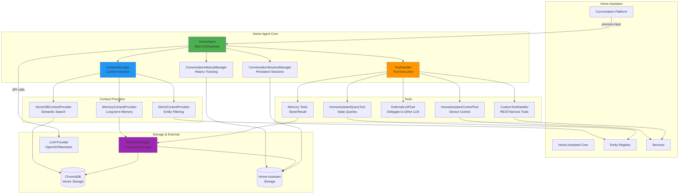
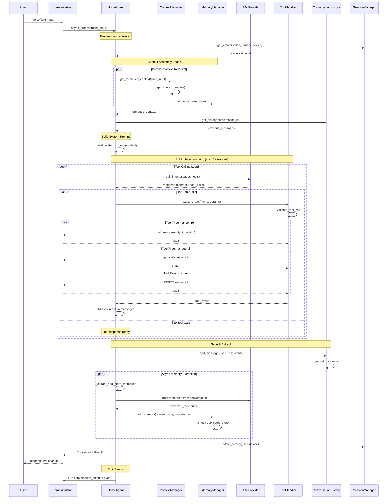
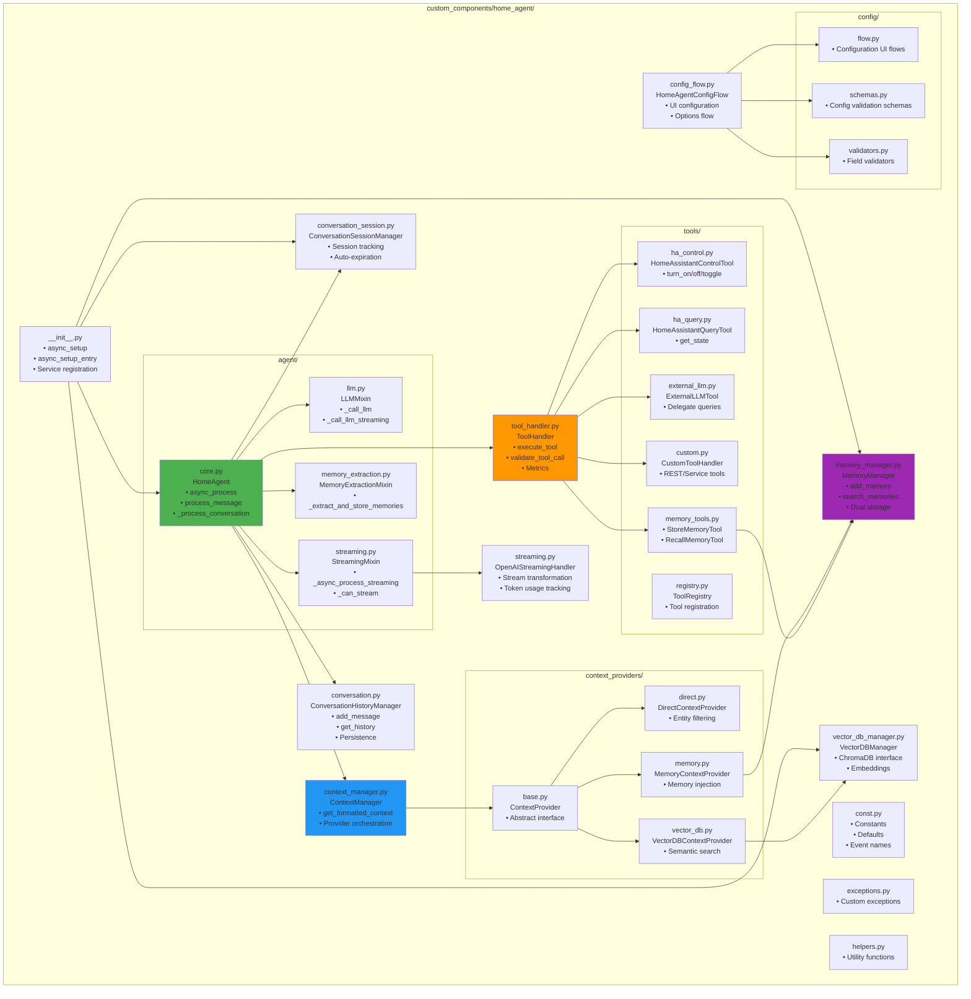
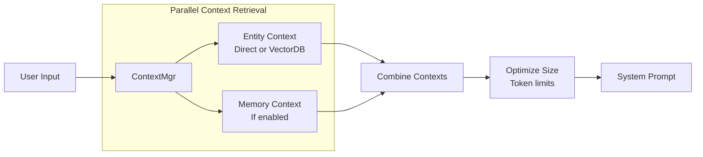
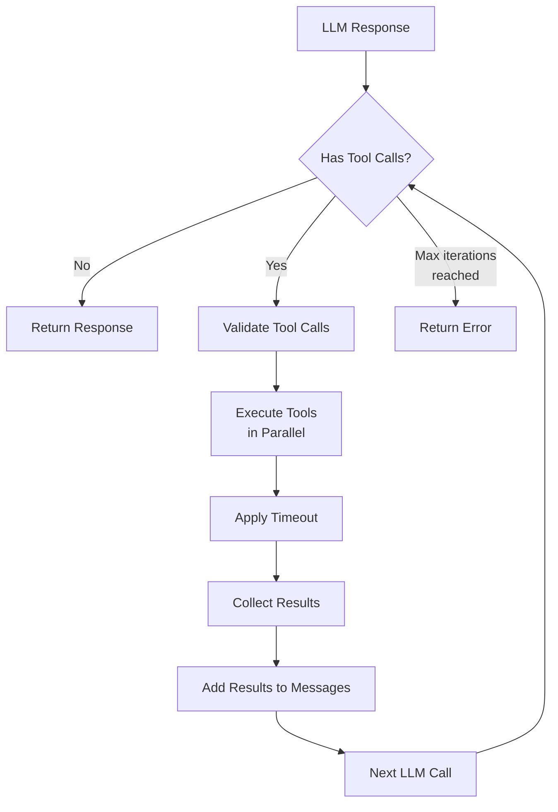
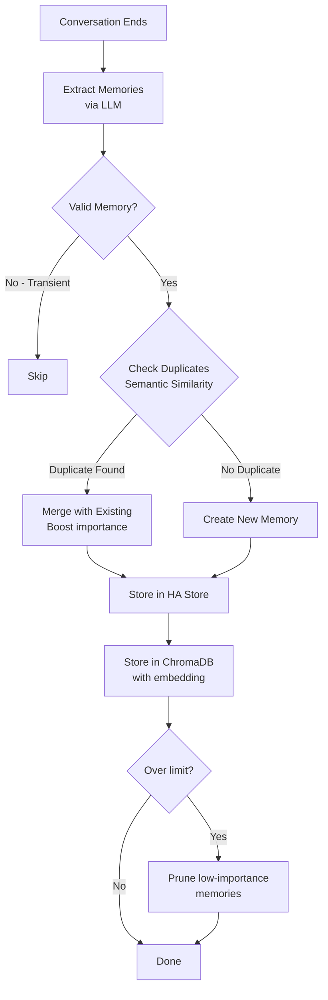
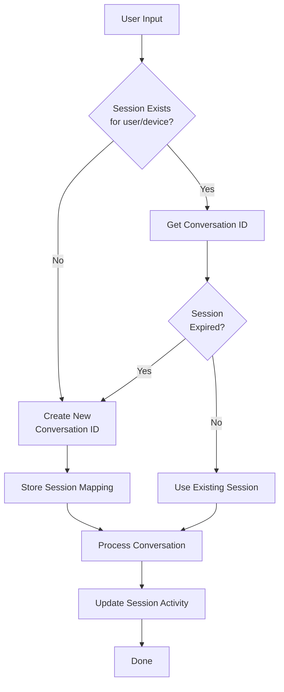
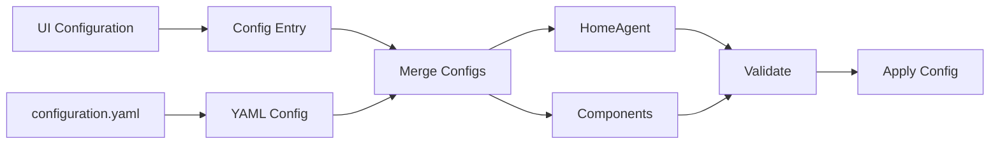

# Architecture Overview

This document provides a comprehensive overview of Home Agent's architecture, including component relationships, data flow, and module structure.

## Table of Contents

- [High-Level Architecture](#high-level-architecture)
- [Conversation Flow](#conversation-flow)
- [Module Structure](#module-structure)
- [Component Details](#component-details)
- [Data Flow Patterns](#data-flow-patterns)

---

## High-Level Architecture

Home Agent is built as a modular Home Assistant custom component that integrates with the native conversation platform. The architecture follows a layered design with clear separation of concerns.



### Key Components

1. **HomeAgent**: Central orchestrator that coordinates all operations
2. **ContextManager**: Manages entity context injection strategies
3. **ConversationHistoryManager**: Tracks conversation history across turns
4. **ToolHandler**: Registers and executes tools called by the LLM
5. **MemoryManager**: Handles long-term memory storage and retrieval
6. **ConversationSessionManager**: Manages persistent voice conversation sessions

---

## Conversation Flow

This diagram shows the complete flow of a user conversation through the system, including context injection, tool calling, and memory extraction.



### Flow Stages

1. **Input Processing**: User input received via Home Assistant conversation platform
2. **Session Management**: Retrieve or create persistent conversation session
3. **Context Assembly**: Parallel retrieval of entity context and memory context
4. **History Integration**: Load previous conversation messages
5. **LLM Interaction**: Iterative loop supporting multiple tool calls per turn
6. **Tool Execution**: Execute tools based on LLM decisions
7. **Response Generation**: Final response from LLM after all tool calls
8. **Persistence**: Save conversation history and extract memories
9. **Event Emission**: Fire Home Assistant events for observability

---

## Module Structure

This diagram shows the directory layout and key classes within the Home Agent codebase.



### Directory Organization

```
custom_components/home_agent/
├── agent/                      # Main agent implementation (mixin-based)
│   ├── core.py                # HomeAgent orchestrator class
│   ├── llm.py                 # LLM API communication
│   ├── streaming.py           # Streaming response support
│   └── memory_extraction.py   # Memory extraction logic
├── context_providers/         # Context injection strategies
│   ├── base.py               # Abstract provider interface
│   ├── direct.py             # Direct entity filtering
│   ├── vector_db.py          # ChromaDB semantic search
│   └── memory.py             # Memory-based context
├── tools/                     # LLM-callable tools
│   ├── ha_control.py         # Home Assistant control
│   ├── ha_query.py           # Home Assistant queries
│   ├── external_llm.py       # External LLM delegation
│   ├── custom.py             # Custom REST/service tools
│   └── memory_tools.py       # Memory operations
├── config/                    # Configuration management
│   ├── flow.py               # Config flow steps
│   ├── schemas.py            # Validation schemas
│   └── validators.py         # Field validators
├── context_manager.py         # Context orchestration
├── conversation.py            # History management
├── conversation_session.py    # Session persistence
├── tool_handler.py            # Tool execution
├── memory_manager.py          # Long-term memory
├── vector_db_manager.py       # ChromaDB interface
├── streaming.py               # Streaming utilities
├── config_flow.py             # UI configuration
└── const.py                   # Constants & defaults
```

---

## Component Details

### HomeAgent (Core)

**Purpose**: Central orchestrator for all conversation-related functionality

**Responsibilities**:
- Process user inputs through Home Assistant's conversation platform
- Build and manage conversation context (system prompts, entity states)
- Execute multi-turn conversations with tool calling support
- Coordinate between LLM, tools, and Home Assistant services
- Track conversation history and metrics
- Support both streaming and synchronous response modes

**Key Methods**:
- `async_process()`: Main entry point from Home Assistant
- `process_message()`: Direct message processing
- `_process_conversation()`: Tool calling loop implementation
- `_build_system_prompt()`: Construct system prompt with context

**Architecture**: Uses mixin-based design inheriting from:
- `LLMMixin`: LLM API communication
- `StreamingMixin`: Real-time streaming responses
- `MemoryExtractionMixin`: Automatic memory extraction
- `AbstractConversationAgent`: Home Assistant integration

---

### ContextManager

**Purpose**: Manages context injection strategies for LLM conversations

**Responsibilities**:
- Orchestrate different context providers (direct, vector DB, memory)
- Optimize context size to stay within token limits
- Cache context when appropriate
- Fire events for observability

**Context Modes**:
1. **Direct Mode**: Static entity list, always includes configured entities
2. **Vector DB Mode**: Dynamic semantic search based on user query
3. **Memory Mode**: Inject relevant long-term memories

**Key Methods**:
- `get_formatted_context()`: Main entry point, returns optimized context
- `get_context()`: Retrieve raw context from provider(s)
- `_optimize_context_size()`: Compress and truncate if needed
- `set_provider()`: Switch context strategy
- `set_memory_provider()`: Enable memory context

---

### ConversationHistoryManager

**Purpose**: Maintain conversation history across multiple turns

**Features**:
- Per-conversation history tracking
- Message and token limits
- Persistent storage across Home Assistant restarts
- Debounced saves to reduce I/O
- Token estimation for context management

**Storage Format**:
```json
{
  "version": 1,
  "conversations": {
    "conversation_id": [
      {"role": "user", "content": "...", "timestamp": 1234567890},
      {"role": "assistant", "content": "..."}
    ]
  }
}
```

**Key Methods**:
- `add_message()`: Add message to history
- `get_history()`: Retrieve recent messages with limits
- `clear_history()`: Clear specific conversation
- `estimate_tokens()`: Estimate token usage

---

### ToolHandler

**Purpose**: Manage tool registration, validation, and execution

**Features**:
- Tool registration and validation
- Timeout enforcement
- Parallel tool execution support
- Execution metrics tracking
- Tool progress events

**Tool Interface**: Each tool must implement:
- `name`: Unique tool identifier
- `execute(**params)`: Async execution method
- `get_definition()`: Return tool schema
- `to_openai_format()`: Format for LLM consumption

**Key Methods**:
- `register_tool()`: Add tool to registry
- `execute_tool()`: Execute with timeout and metrics
- `get_tool_definitions()`: Format all tools for LLM
- `validate_tool_call()`: Pre-execution validation

---

### MemoryManager

**Purpose**: Long-term memory storage and retrieval system

**Features**:
- Dual storage: Home Assistant Store + ChromaDB
- Memory types: facts, preferences, context, events
- Importance scoring with decay
- Deduplication via semantic similarity
- TTL-based expiration
- Periodic cleanup

**Memory Lifecycle**:
1. **Extraction**: Async extraction from conversations
2. **Validation**: Filter out transient/low-quality content
3. **Deduplication**: Check semantic similarity to existing memories
4. **Storage**: Store in both HA Store and ChromaDB
5. **Retrieval**: Semantic search based on user queries
6. **Decay**: Importance score decreases over time
7. **Expiration**: Remove based on TTL and importance

**Key Methods**:
- `add_memory()`: Store new memory with deduplication
- `search_memories()`: Semantic similarity search
- `apply_importance_decay()`: Reduce importance over time
- `_cleanup_expired_memories()`: Remove expired memories

---

### ConversationSessionManager

**Purpose**: Maintain persistent conversation sessions for voice interactions

**Features**:
- User/device-based session mapping
- Automatic expiration (configurable timeout)
- Persistent storage across restarts
- Session activity tracking

**Use Case**: Enables natural multi-turn voice conversations where follow-up questions maintain context without explicitly providing conversation IDs.

**Example**:
```
User: "What's the temperature in the living room?"
Agent: "The living room is 72°F"
[Later, same device]
User: "What about the bedroom?"
Agent: "The bedroom temperature is 68°F"  # Maintains context
```

---

## Data Flow Patterns

### Context Injection Pattern



### Tool Execution Pattern



### Memory Storage Pattern



### Session Persistence Pattern



---

## Integration Points

### Home Assistant Integration

1. **Conversation Platform**: Registers as `AbstractConversationAgent`
2. **Entity Registry**: Accesses entity states and metadata
3. **Service Calls**: Executes Home Assistant services via tools
4. **Storage**: Uses `Store` helper for persistence
5. **Events**: Fires custom events for observability
6. **Config Flow**: Provides UI configuration

### External Integrations

1. **LLM Providers**: OpenAI-compatible API (OpenAI, Ollama, LocalAI, etc.)
2. **ChromaDB**: Vector database for semantic search and memory storage
3. **Embeddings**: OpenAI embeddings API or Ollama for vector generation

---

## Performance Considerations

### Optimization Strategies

1. **Parallel Context Retrieval**: Entity and memory context fetched simultaneously
2. **Context Caching**: Cache context based on mode and input
3. **Debounced Saves**: Reduce I/O with delayed persistence
4. **Token Optimization**: Compress and truncate context to stay within limits
5. **Streaming Responses**: ~10x faster response time for voice assistants
6. **Lazy Tool Registration**: Defer registration until first use

### Scalability

- **Memory Limits**: Configurable max memories (default: 1000)
- **History Limits**: Configurable max messages and tokens
- **Tool Timeouts**: Prevent hanging tool executions (default: 30s)
- **Session Expiration**: Automatic cleanup of inactive sessions (default: 1 hour)
- **Periodic Cleanup**: Background task for memory maintenance

---

## Error Handling

### Exception Hierarchy

```
HomeAgentError (base)
├── ContextInjectionError
├── ToolExecutionError
├── ValidationError
├── TokenLimitExceeded
└── LLMError
```

### Fallback Strategies

1. **Streaming Failure**: Falls back to synchronous mode
2. **ChromaDB Unavailable**: Falls back to store-only mode for memory
3. **Context Too Large**: Truncates with warning
4. **Tool Timeout**: Returns error to LLM, continues conversation
5. **Memory Extraction Failure**: Logs error, conversation continues

---

## Event System

Home Agent emits events for observability and automation:

- `home_agent.conversation.started`
- `home_agent.conversation.finished` (with metrics)
- `home_agent.context.injected`
- `home_agent.context.optimized`
- `home_agent.tool.executed`
- `home_agent.tool.progress`
- `home_agent.error`
- `home_agent.streaming.error`
- `home_agent.memory.extracted`
- `home_agent.history.saved`

Events can be used for:
- Monitoring and alerting
- Triggering automations
- Collecting metrics (Prometheus, InfluxDB)
- Debugging and troubleshooting

---

## Configuration Architecture

Configuration is managed through multiple layers:

1. **Config Entry**: Primary configuration via UI
2. **Options Flow**: Runtime reconfiguration via UI
3. **YAML Config**: Custom tools and advanced settings
4. **Runtime Updates**: Live config updates without restart

### Configuration Flow



---

## Security Considerations

1. **API Key Storage**: Stored securely in Home Assistant config entry
2. **Entity Exposure**: Respects Home Assistant's exposure settings
3. **Tool Validation**: Validates all tool calls before execution
4. **Timeout Enforcement**: Prevents runaway tool executions
5. **Template Sandboxing**: Uses Home Assistant's template engine
6. **Service Call Security**: Uses Home Assistant's permission system

---

## Further Reading

- [Configuration Reference](CONFIGURATION.md)
- [Custom Tools Guide](CUSTOM_TOOLS.md)
- [Memory System](MEMORY_SYSTEM.md)
- [API Reference](API_REFERENCE.md)
- [Development Standards](.claude/docs/DEVELOPMENT.md)
